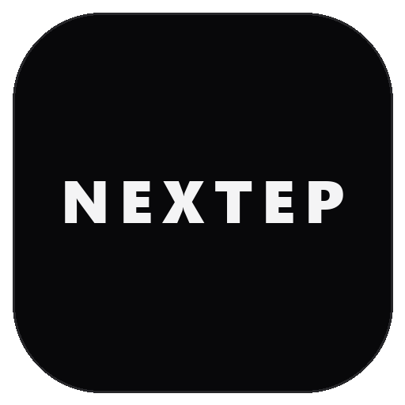

<p align="center">
  
</p>

<h1 align="center">NEXTEP</h1>

<p align="center">
  <a href="https://github.com/kentobi09/NextEp/raw/main/NextEp.apk">
    
  </a>
</p>

<p align="center">
  <a href="https://github.com/kentobi09/NextEp/raw/main/NextEp.apk"><b>Download NextEp.apk (Direct Link)</b></a>
</p>

---

## Overview

**NextEp** is an editorial, dark-mode native Android episode tracker and notification assistant designed for anime and international TV series enthusiasts. Built with modern Android architecture (Jetpack Compose, Kotlin Coroutines, Room Database, AlarmManager, and WorkManager), NextEp keeps you on top of upcoming broadcasts with high precision and zero clutter.

Whether you're following seasonal anime releases from AniList or worldwide TV series from TVMaze, NextEp brings your entire watchlist together in one unified, cinema-dark dashboard with customizable episode release alerts.

---

## Key Features

- **Unified Anime & TV Series Tracking**: Search and track across Japanese anime and international TV series seamlessly from AniList and TVMaze APIs.
- **Swipeable Airing Next Carousel**: A dynamic hero pager on the home dashboard highlighting upcoming episodes in your watchlist with real-time countdown timers.
- **Precise Release Alarms**: Native Android `AlarmManager` wake-up alarms with configurable lead-time notifications (15m, 30m, 1 hour, or at exact release time) even when the device is idle or rebooted.
- **Minimalist Editorial Dark UI**: High-contrast pitch-black backdrop (`#08080A`), dark charcoal containers (`#121217`), crisp typography, and cinema red (`#E50914`) accents.
- **Decluttered Discovery & Genre Filtering**: Explore trending shows, top-airing releases, and today's schedule, with quick-tap genre filters (Action, Drama, Sci-Fi, Comedy, Crime, Horror, Mystery, Thriller, etc.).
- **Weekly Broadcast Schedule**: Week-strip day picker (Mon–Sun) displaying scheduled releases chronologically for titles in your watchlist.
- **Pull-to-Refresh & Periodic Background Sync**: Pull down anywhere on the home screen to refresh schedules immediately, backed by an automated WorkManager background sync.
- **Offline Watchlist Storage**: Powered by Room Database for instant, offline-first access to your watchlist, metadata, and episode counts.

---

## Direct APK Installation Guide

Installing **NextEp** on your Android device is fast and simple:

### Step 1: Download NextEp.apk
Click the badge above or download directly from GitHub:
👉 **[Download NextEp.apk](https://github.com/kentobi09/NextEp/raw/main/NextEp.apk)**

### Step 2: Open and Install
1. Open your browser's **Downloads** folder or tap the completed download notification.
2. If Android prompts *"For your security, your phone is not allowed to install unknown apps from this source"*:
   - Tap **Settings**.
   - Toggle **Allow from this source** to ON.
   - Return and tap **Install**.

### Step 3: Grant Notification & Alarm Permissions
1. On first launch, grant **Notification** permissions so NextEp can alert you when episodes air.
2. For devices on Android 12+ (API 31+), ensure **Alarms & Reminders** (Exact Alarms) permission is enabled in App Settings so alerts trigger to the exact minute.

---

## Technical Architecture

| Component | Technology | Description |
|---|---|---|
| **UI Layer** | Jetpack Compose, Material 3 | Modern declarative reactive UI with dark editorial theme |
| **Architecture** | MVVM / MVI Pattern | Unidirectional data flow using StateFlow and Kotlin Coroutines |
| **Local Database** | Room DB, SQLite | Offline persistence for saved anime and TV series entities |
| **Remote APIs** | AniList GraphQL, TVMaze REST | Multi-source catalog aggregation with in-memory caching |
| **Notifications** | AlarmManager, BroadcastReceiver | Exact RTC_WAKEUP alarms with custom lead time calculations |
| **Background Sync** | WorkManager | Periodic background worker syncing air dates every 6 hours |
| **Image Loading** | Coil Compose | Asynchronous image loading with crossfade and memory cache |

---

## Development & Build

### Prerequisites
- Android Studio Ladybug (or newer)
- JDK 17+
- Android SDK 34 (API Level 34)

### Clone & Open
```bash
git clone https://github.com/kentobi09/NextEp.git
cd NextEp
```

### Build APK via Gradle
```bash
# Build debug APK
./gradlew assembleDebug

# Output APK located at:
# app/build/outputs/apk/debug/app-debug.apk
```

---


